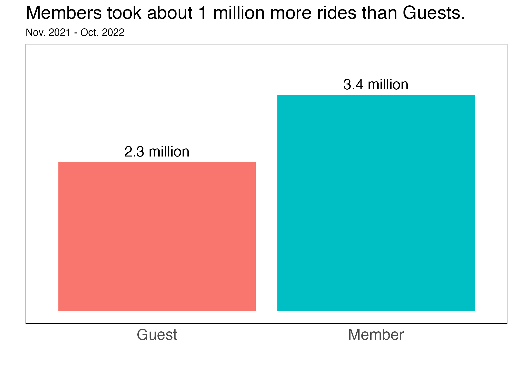
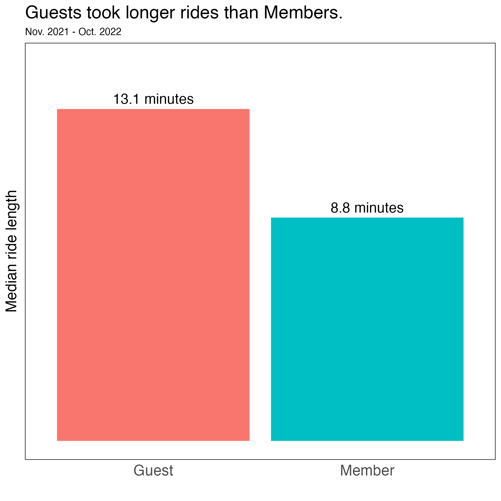
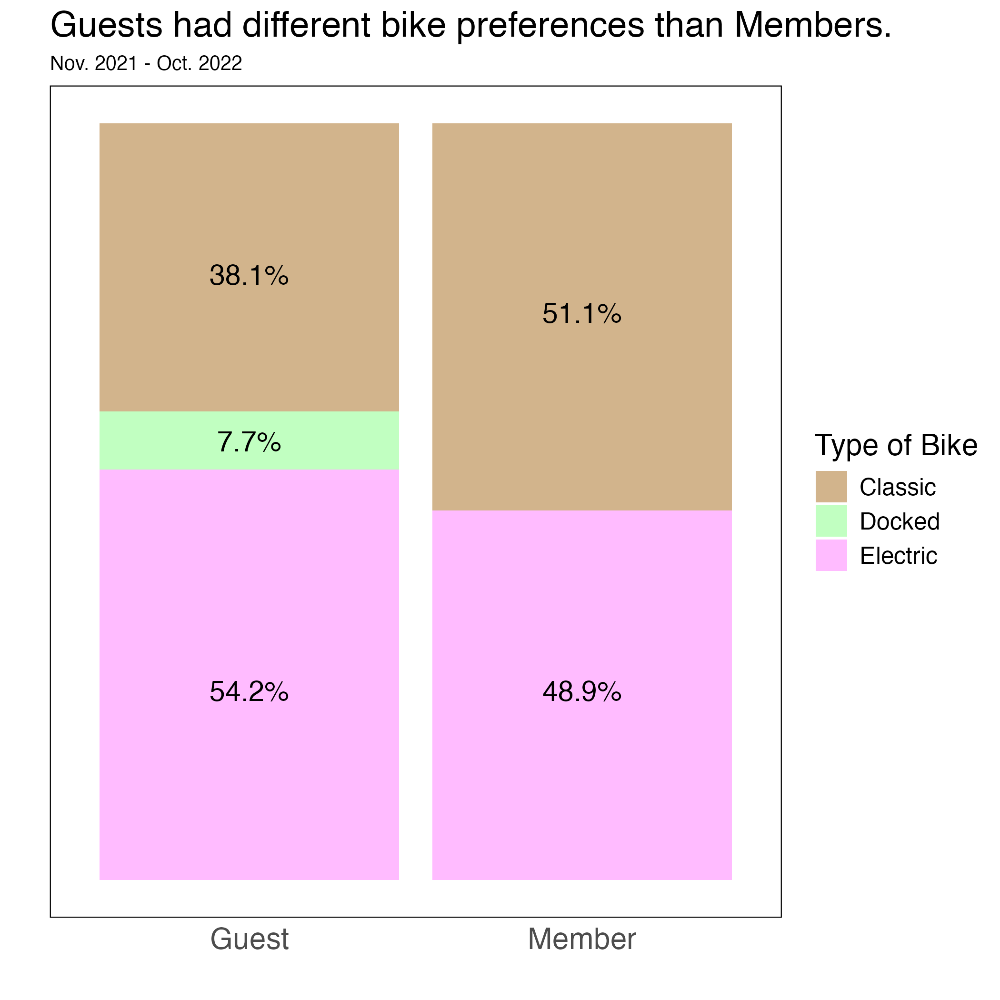
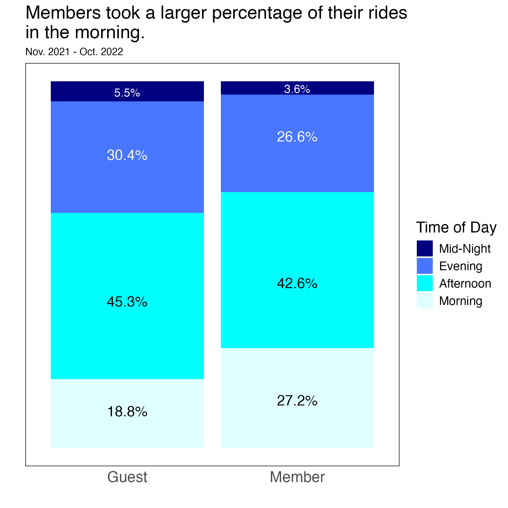
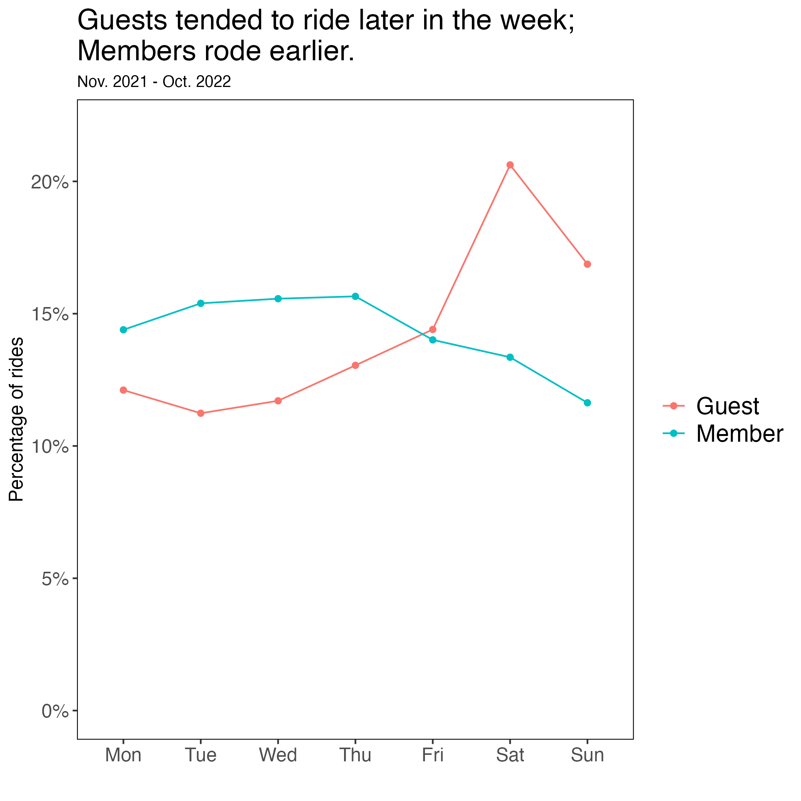
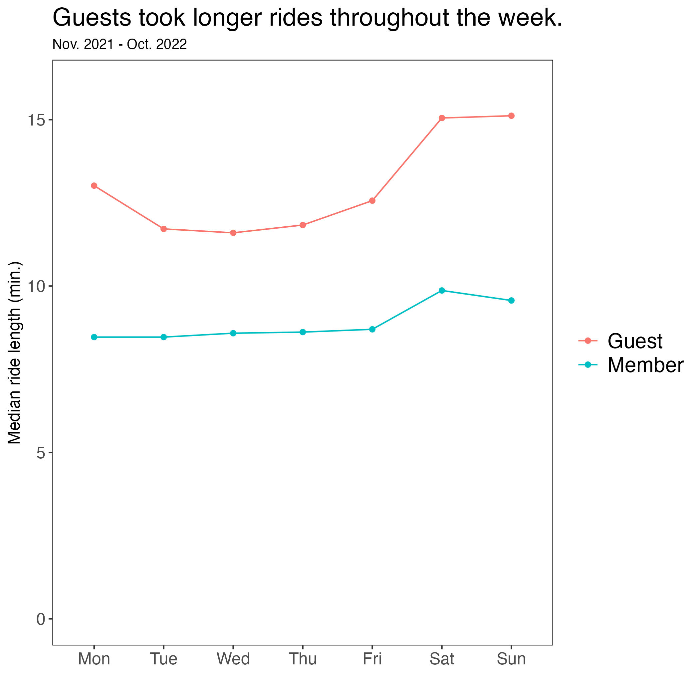
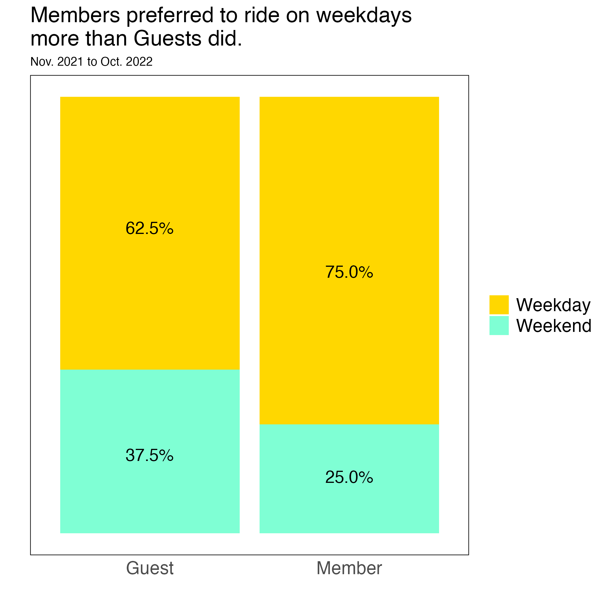
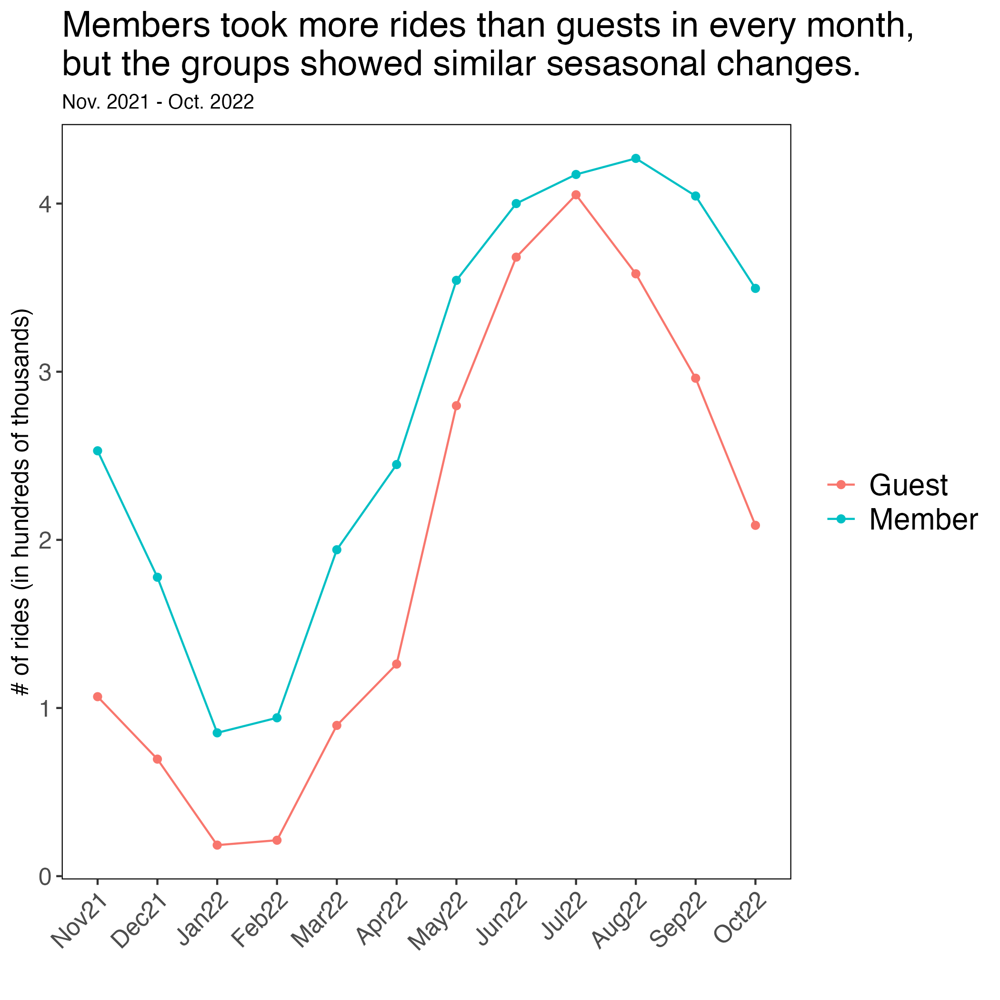
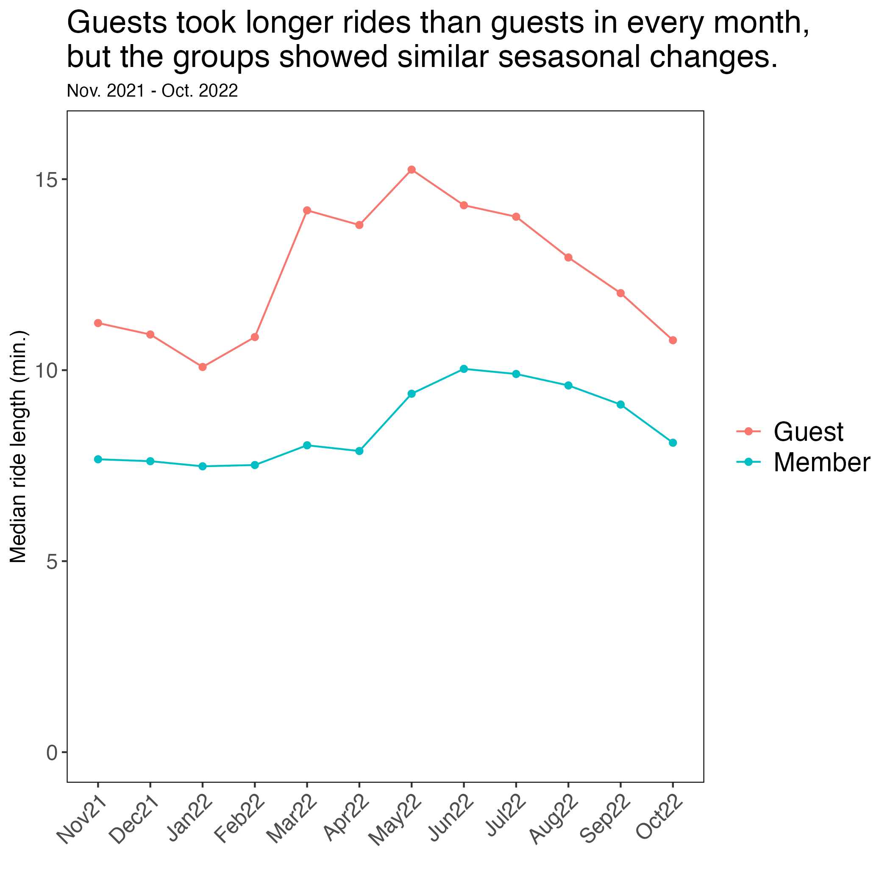

# Case Study: How does a bike share navigate speedy success?
Scottie Szewczyk

# Overview

In this document, we will perform an analysis for a fictional rideshare
bicycle company called Cyclistic. The goal of this analysis is to
understand how annual Members and Guest riders used the company’s bikes
differently over the time period of November 2021 to October 2022.

**If you would like to understand the background scenario for this
project, please read the “Scenario” section. If you just want to see the
analysis itself, feel free to skip directly to the “Data” section.**

# Scenario

*You are a junior data analyst working in the marketing analyst team at
Cyclistic, a bike-share company in Chicago. The director of marketing
believes the company’s future success depends on maximizing the number
of annual memberships. Therefore, your team wants to understand how
casual riders and annual members use Cyclistic bikes differently. From
these insights, your team will design a new marketing strategy to
convert casual riders into annual members. But first, Cyclistic
executives must approve your recommendations, so they must be backed up
with compelling data insights and professional data visualizations.*

## Characters and teams

- <u>Cyclistic:</u> A bike-share program that features more than 5,800
  bicycles and 600 docking stations. Cyclistic sets itself apart by also
  offering reclining bikes, hand tricycles, and cargo bikes, making
  bike-share more inclusive to people with disabilities and riders who
  can’t use a standard two-wheeled bike. The majority of riders opt for
  traditional bikes; about 8% of riders use the assistive options.
  Cyclistic users are more likely to ride for leisure, but about 30% use
  them to commute to work each day.

- <u>Lily Moreno:</u> The director of marketing and your manager. Moreno
  is responsible for the development of campaigns and initiatives to
  promote the bike-share program. These may include email, social media,
  and other channels. 

- <u>Cyclistic marketing analytics team:</u> A team of data analysts who
  are responsible for collecting, analyzing, and reporting data that
  helps guide Cyclistic marketing strategy. You joined this team six
  months ago and have been busy learning about Cyclistic’s mission and
  business goals — as well as how you, as a junior data analyst, can
  help Cyclistic achieve them.

- <u>Cyclistic executive team:</u> The notoriously detail-oriented
  executive team will decide whether to approve the recommended
  marketing program.

## About the company

*In 2016, Cyclistic launched a successful bike-share offering. Since
then, the program has grown to a fleet of 5,824 bicycles that are
geotracked and locked into a network of 692 stations across Chicago. The
bikes can be unlocked from one station and returned to any other station
in the system anytime. Until now, Cyclistic’s marketing strategy relied
on building general awareness and appealing to broad consumer segments.
One approach that helped make these things possible was the flexibility
of its pricing plans: single-ride passes, full-day passes, and annual
memberships. Customers who purchase single-ride or full-day passes are
referred to as casual riders. Customers who purchase annual memberships
are Cyclistic members. Cyclistic’s finance analysts have concluded that
annual members are much more profitable than casual riders. Although the
pricing flexibility helps Cyclistic attract more customers, Moreno
believes that maximizing the number of annual members will be key to
future growth. Rather than creating a marketing campaign that targets
all-new customers, Moreno believes there is a very good chance to
convert casual riders into members. She notes that casual riders are
already aware of the Cyclistic program and have chosen Cyclistic for
their mobility needs. Moreno has set a clear goal: Design marketing
strategies aimed at converting casual riders into annual members. In
order to do that, however, the marketing analyst team needs to better
understand how annual members and casual riders differ, why casual
riders would buy a membership, and how digital media could affect their
marketing tactics. Moreno and her team are interested in analyzing the
Cyclistic historical bike trip data to identify trends.*

# Business goal

The goal of this analysis is to understand how annual Members and Guest
riders used Cyclistic’s bikes differently over the time period of
November 2021 to October 2022.

# Data

## Data source

- I analyzed Cyclistic’s monthly trip data from November 2021 - October
  2022, made available from Motivate International Inc., under the
  license found here:
  <https://ride.divvybikes.com/data-license-agreement>

- Cyclistic is a fictional company, but I will treat the data as if it
  is first-party data collected by Cyclistic.

## Data credibility

Using Google’s **ROCCC** checklist, the data is:

- <u>**R**eliable:</u> Since we are treating the data as if it is
  first-party data from Cyclistic, we can assume that it is mostly
  reliable. Many station names and IDs in the datasets are left blank.
  We will assume that the data are otherwise correct in spite of these
  blanks.

- <u>**O**riginal:</u> Again, since we are using  first-party data, then
  the data is original.

- <u>**C**omprehensive:</u> To protect user privacy, the data do not
  identify specific users (i.e. a person taking two rides is
  indistinguishable from two people taking one ride each), limiting the
  inferences that we can make.

- <u>**C**urrent:</u> Cyclistic provides clearly-labeled monthly
  datasets containing ride data from each month, so the data is current.

- <u>**C**ited:</u> In this case, “Cited” means “properly vetted”. Since
  this is first-party data, then we can consider it cited as well.

## Description of the data

For each month, Cyclistic provides a dataset containing the following
information on each individual use of a Cyclistic bicycle:

- Ride ID

- Type of Bike (Classic, Electric, or Docked)

- Date/time that the ride started; Date/time that the ride ended

- Start station (including the ID of the station); End station (inluding
  the ID of the station)

- Starting and Ending Latitude; Starting and Ending Longitude

- Rider type (Member or Casual (AKA “Guest”)

# Setup

## Import libraries and create dataset

``` r
library(data.table)
library(tidyverse)
library(lubridate)
library(scales)

# Import the monthly ride data. fread() uses less memory in R than read.csv
nov2021 <- fread("data/202111-divvy-tripdata.csv")
dec2021 <- fread("data/202112-divvy-tripdata.csv")
jan2022 <- fread("data/202201-divvy-tripdata.csv")
feb2022 <- fread("data/202202-divvy-tripdata.csv")
mar2022 <- fread("data/202203-divvy-tripdata.csv")
apr2022 <- fread("data/202204-divvy-tripdata.csv")
may2022 <- fread("data/202205-divvy-tripdata.csv")
jun2022 <- fread("data/202206-divvy-tripdata.csv")
jul2022 <- fread("data/202207-divvy-tripdata.csv")
aug2022 <- fread("data/202208-divvy-tripdata.csv")
sep2022 <- fread("data/202209-divvy-publictripdata.csv")
oct2022 <- fread("data/202210-divvy-tripdata.csv")
```

``` r
# Combine all 12 monthly datasets into one, called "allmonths".
months_list <- list(nov2021, dec2021, jan2022,
                    feb2022, mar2022, apr2022,
                    may2022, jun2022, jul2022,
                    aug2022, sep2022, oct2022)

allmonths <- reduce(months_list, full_join)
```

## Data cleaning

First, we will create the `ridelength` column, which is the length of
time for each ride.

We will also remove all observations with erroneous values of
`ridelength`. That is, we will remove all values of `ridelength` \<= 0
and rides that took longer than 1 day (or 1440 minutes).

``` r
# Add ride length column.
# Also, remove all rows from each month where "ridelength" is less than or equal to 0 seconds
# or greater than or equal to 24 hours (1440 minutes).
allmonths <- allmonths %>%
              mutate(ridelength = as.numeric((ended_at - started_at)/60)) %>%
                filter(ridelength > 0 & ridelength < 1440)

# Find the minimum and maximum ridelengths after filtering.
min(allmonths$ridelength)
```

    [1] 0.01666667

``` r
max(allmonths$ridelength)
```

    [1] 1439.95

The `ridelength` values are now all between 0 and 1440 minutes.

Next, we will identify the times that a ride occurred across different
intervals: the day of the week (`day`), whether the ride was on a
weekday or weekend (`wkend_wkday`), the time of day during which a ride
started (`time_of_day`), and the month that a ride happened in
(`month`).

``` r
# Identify the day of the week that a ride was taken
allmonths <- allmonths %>%
              mutate(day = factor(weekdays(as.Date(allmonths$started_at),
                                           abbreviate = TRUE),
                                  level = c('Mon', 'Tue', 'Wed',
                                            'Thu', 'Fri', 'Sat', 'Sun')))
              
# Identify whether the ride was on a weekday or the weekend.
allmonths <- allmonths %>%
              mutate(wkend_wkday = ifelse(allmonths$day %in% c("Sat", "Sun"),
                                          "Weekend", "Weekday"))

# Identify the time of day that a ride occurred. 
allmonths <- allmonths %>%
  mutate(hour_ride = hour(started_at)) %>%
  mutate(time_of_day = factor(
    case_when(
      hour_ride >= 00 & hour_ride < 06 ~ "Mid-Night",
      hour_ride >= 06 & hour_ride < 12 ~ "Morning",
      hour_ride >= 12 & hour_ride < 18 ~ "Afternoon",
      hour_ride >= 18 & hour_ride < 24 ~ "Evening"),
    levels = c("Mid-Night", "Evening",
               "Afternoon", "Morning")))

# Identify the month that a ride occured.
allmonths <- allmonths %>%
              mutate(month = month(started_at, label = TRUE))

# Rename the months for clarity when graphing
allmonths <- allmonths %>%
              mutate(month = factor(
                case_when(
                  month == 'Nov' ~ 'Nov21',
                  month == 'Dec' ~ 'Dec21',
                  month == 'Jan' ~ 'Jan22',
                  month == 'Feb' ~ 'Feb22',
                  month == 'Mar' ~ 'Mar22',
                  month == 'Apr' ~ 'Apr22',
                  month == 'May' ~ 'May22',
                  month == 'Jun' ~ 'Jun22',
                  month == 'Jul' ~ 'Jul22',
                  month == 'Aug' ~ 'Aug22',
                  month == 'Sep' ~ 'Sep22',
                  month == 'Oct' ~ 'Oct22'),
                levels = c('Nov21', 'Dec21', 'Jan22',
                           'Feb22', 'Mar22', 'Apr22',
                           'May22', 'Jun22', 'Jul22',
                           'Aug22', 'Sep22', 'Oct22'
              )))
```

Finally, we will rename the membership and bike type values for clarity.

``` r
# Update the values of "member_casual" and "rideable type."
allmonths <- allmonths %>%
              mutate(member_casual = ifelse(allmonths$member_casual == 'member', 'Member', 'Guest')) %>%
              mutate(rideable_type = case_when(
                allmonths$rideable_type == 'electric_bike' ~ 'Electric',
                allmonths$rideable_type == 'classic_bike' ~ 'Classic',
                allmonths$rideable_type == 'docked_bike' ~ 'Docked'
              ))

# Check whether the values of "member_casual" and "rideable type" are unique
unique(allmonths$member_casual)
```

    [1] "Guest"  "Member"

``` r
unique(allmonths$rideable_type)
```

    [1] "Electric" "Classic"  "Docked"  

# Data Analysis

Our analysis will focus on the difference between the two types of
riders: Members and Guests.

## General Differences

First, we will examine the general differences between the rider types —
that is, the differences between Members and Guests without respect to
time.

### Total Rides

We will start by simply comparing the number of rides taken by each
rider type.

``` r
# Count the number of rides for each membership type.
allmonths %>%
  group_by(member_casual) %>%
  summarize(count = n())
```

| member_casual |   count |
|:--------------|--------:|
| Guest         | 2348089 |
| Member        | 3401675 |

``` r
# Create bar graph of number of rides for each membership type.
p <- allmonths %>%
  group_by(member_casual) %>%
    summarize(count = n()) %>%
      ggplot(aes(x = member_casual, y = count, fill = member_casual)) +
        geom_col() +
        labs(title = 'Members took about 1 million more rides than Guests.',
        subtitle = 'Nov. 2021 - Oct. 2022', x = '', y = '') +
        geom_text(aes(label = label_number(scale = 1e-6, suffix = " million")(count)),
                  vjust = -0.5, size = 5) + # Add labels to bar chart
        theme(
          panel.background = element_blank(), # Removes gridlines and background color.
          panel.border = element_rect(color = 'black', fill = NA), # Adds a border to the graph
          axis.text.x=element_text(size=15), # X-axis labels font size
          axis.ticks.x = element_blank(),
          axis.ticks.y = element_blank(), # Remove Y-axis ticks
          axis.text.y = element_blank(), # Remove Y-axis text
          plot.subtitle = element_text(size = 10), # Subtitle font size
          text = element_text(size = 15), # Title font size
          legend.position = 'none' # Remove the legend
        ) +
        scale_y_continuous(limits = c(0, 4000000)) # Adjust Y-axis scale

ggsave('plot1.png', plot = p)
```

    Saving 7 x 5 in image



Over the course of the year (Nov. 2021 - Oct. 2022), there were about 1
million more rides taken by Members than by Guests.

It is important to note that these numbers refer to the **number of
rides taken**, NOT the number of riders. It is possible, for example,
that the two groups are composed of the same number of people.

### Average ride length

Next, we will compare the average `ridelength` between the two groups.

``` r
# Count the number of rides for each membership type.
allmonths %>%
  group_by(member_casual) %>%
  summarize(mean_ridelength = mean(ridelength),
            median_ridelength = median(ridelength),
            std_dev_ridelength = sd(ridelength))
```

| member_casual | mean_ridelength | median_ridelength | std_dev_ridelength |
|:--------------|----------------:|------------------:|-------------------:|
| Guest         |        22.03600 |         13.133333 |           39.55097 |
| Member        |        12.40803 |          8.833333 |           18.94490 |

``` r
# Create bar graph of median ride length for each membership type.
p <- allmonths %>%
  group_by(member_casual) %>%
    summarize(median_ridelength = median(ridelength)) %>%
      ggplot(aes(x = member_casual, y = median_ridelength, fill = member_casual)) +
        geom_col() +
          labs(title = 'Guests took longer rides than Members.',
               subtitle = 'Nov. 2021 - Oct. 2022', x = '', y = 'Median ride length') +
        geom_text(aes(label = label_number(suffix = " minutes")(median_ridelength)),
                  vjust = -0.5, size = 5) + # Add labels to bar chart
        theme(
          panel.background = element_blank(), # Removes gridlines and background color.
          panel.border = element_rect(color = 'black', fill = NA), # Adds a border to the graph
          axis.text.x=element_text(size=15), # X-axis labels font size
          axis.ticks.x = element_blank(),
          axis.ticks.y = element_blank(), # Remove Y-axis ticks
          axis.text.y = element_blank(), # Remove Y-axis text
          plot.subtitle = element_text(size = 10), # Subtitle font size
          text = element_text(size = 15), # Title font size
          legend.position = 'none' # Remove the legend
        ) + 
        scale_y_continuous(limits = c(0, 15)) # Adjust Y-axis scale

ggsave('plot2.png', plot = p)
```

    Saving 7 x 5 in image



Guest riders’ median ride length is **almost 50% longer** as that of
Members. This difference is preserved, but more pronounced, when
comparing the mean ride lengths.

Also, Guest riders’ ride lengths are also much **more variable** than
that of Members: the SD of Guests’ rides is 39.6 minutes, compared to
Members’ SD of 18.9 minutes.

### Type of Bike

Next, we will compare the bike types that Members and Guests tend to
use.

``` r
#Calculate the percentage of rides using a particular bike for both membership types.
allmonths %>%
  group_by(member_casual, rideable_type) %>%
    summarize(num_rides = n()) %>%
        summarize(rideable_type = rideable_type,
                  percent = 100*num_rides / sum(num_rides))
```

    `summarise()` has grouped output by 'member_casual'. You can override using the
    `.groups` argument.

    Warning: Returning more (or less) than 1 row per `summarise()` group was deprecated in
    dplyr 1.1.0.
    ℹ Please use `reframe()` instead.
    ℹ When switching from `summarise()` to `reframe()`, remember that `reframe()`
      always returns an ungrouped data frame and adjust accordingly.

    `summarise()` has grouped output by 'member_casual'. You can override using the
    `.groups` argument.

| member_casual | rideable_type |   percent |
|:--------------|:--------------|----------:|
| Guest         | Classic       | 38.105455 |
| Guest         | Docked        |  7.672622 |
| Guest         | Electric      | 54.221923 |
| Member        | Classic       | 51.143275 |
| Member        | Electric      | 48.856725 |

``` r
#Stacked bar chart: percentage of rides using a particular bike by membership type.
p <-   ggplot(data = allmonths, aes(x=member_casual, fill = rideable_type)) +
  geom_bar(position = "fill") +
    labs(title = 'Guests had different bike preferences than Members.',
               subtitle = 'Nov. 2021 - Oct. 2022', x = '', y = '') +
          scale_fill_manual(labels = c("Classic", "Docked", "Electric"),
                            values = c("tan", "darkseagreen1", "plum1")) +
          guides(fill=guide_legend(title="Type of Bike")) +
          theme(
            panel.background = element_blank(), # Removes gridlines and background color.
            panel.border = element_rect(color = 'black', fill = NA), # Adds border to graph
            axis.text.x=element_text(size=15), # X-axis labels font size
            axis.ticks.x = element_blank(),
            axis.ticks.y = element_blank(), # Remove Y-axis ticks
            axis.text.y = element_blank(), # Remove Y-axis text
            plot.subtitle = element_text(size = 10), # Subtitle font size
            text = element_text(size = 15), # Title font size
          ) +
          annotate('text', label = "54.2%", x = 1, y = .25, size = 5, color = "black") +
          annotate('text', label = "7.7%", x = 1, y = .58, size = 5, color = "black") +
          annotate('text', label = "38.1%", x = 1, y = .80, size = 5, color = "black") +
          annotate('text', label = "48.9%", x = 2, y = .25, size = 5, color = "black") +
          annotate('text', label = "51.1%", x = 2, y = .75, size = 5, color = "black")

ggsave('plot3.png', plot = p)
```

    Saving 7 x 5 in image



Guests have a clear order of favorites:

1.  Electric

2.  Classic

3.  Docked (although this category was rarely used).

Members, on the other hand, are nearly evenly split between Classic and
Electric bikes and do not use Docked bikes at all.

## Differences over the day

Next, we will examine the time(s) of day that the two groups tend to
ride.

### Time of day

The times of day are defined as follows:

- Mid-Night: 12 A.M. - 6 A.M.

- Evening: 6 P.M. - 12 A.M.

- Afternoon: 12 P.M. - 6 P.M.

- Morning: 6 A.M. - 12 P.M.

``` r
# Calculate the percentage of rides by time of day for each membership group
allmonths %>%
  group_by(member_casual, time_of_day) %>%
    summarize(num_rides = n()) %>%
        summarize(time_of_day = time_of_day,
                  percent = 100*num_rides / sum(num_rides))
```

    `summarise()` has grouped output by 'member_casual'. You can override using the
    `.groups` argument.

    Warning: Returning more (or less) than 1 row per `summarise()` group was deprecated in
    dplyr 1.1.0.
    ℹ Please use `reframe()` instead.
    ℹ When switching from `summarise()` to `reframe()`, remember that `reframe()`
      always returns an ungrouped data frame and adjust accordingly.

    `summarise()` has grouped output by 'member_casual'. You can override using the
    `.groups` argument.

| member_casual | time_of_day |   percent |
|:--------------|:------------|----------:|
| Guest         | Mid-Night   |  5.456522 |
| Guest         | Evening     | 30.431598 |
| Guest         | Afternoon   | 45.341297 |
| Guest         | Morning     | 18.770583 |
| Member        | Mid-Night   |  3.588967 |
| Member        | Evening     | 26.601248 |
| Member        | Afternoon   | 42.600954 |
| Member        | Morning     | 27.208831 |

``` r
# Stacked bar chart: percentage of each membership group's rides started during each part of the day.
p <- ggplot(data = allmonths, aes(x = member_casual,
                             fill = time_of_day)) +
  geom_bar(position = "fill") +
  labs(title = 'Members took a larger percentage of their rides\nin the morning.',
               subtitle = 'Nov. 2021 - Oct. 2022', x = '', y = '') +
  scale_fill_manual(values = c("navy", "royalblue1", "cyan1", "lightcyan1")) +
  guides(fill=guide_legend(title="Time of Day")) +
    theme(
        panel.background = element_blank(), # Removes gridlines and background color.
        panel.border = element_rect(color = 'black', fill = NA), # Adds border to graph
        axis.text.x=element_text(size=15), # X-axis labels font size
        axis.ticks.x = element_blank(),
        axis.ticks.y = element_blank(), # Remove Y-axis ticks
        axis.text.y = element_blank(), # Remove Y-axis text
        plot.subtitle = element_text(size = 10), # Subtitle font size
        text = element_text(size = 15), # Title font size
        ) +
  annotate('text', label = "18.8%", x = 1, y = .10, size = 5, color = "black") +
  annotate('text', label = "45.3%", x = 1, y = .40, size = 5, color = "black") +
  annotate('text', label = "30.4%", x = 1, y = .80, size = 5, color = "white") +
  annotate('text', label = "5.5%", x = 1, y = .97, size = 4, color = "white") +
  annotate('text', label = "27.2%", x = 2, y = .13, size = 5, color = "black") +
  annotate('text', label = "42.6%", x = 2, y = .45, size = 5, color = "black") +
  annotate('text', label = "26.6%", x = 2, y = .85, size = 5, color = "white") +
  annotate('text', label = "3.6%", x = 2, y = .98, size = 4, color = "white")

ggsave('plot4.png', plot = p)
```

    Saving 7 x 5 in image



The largest difference is that Members take a much larger percentage of
their rides in the **morning** than do Guests.

## Differences over the week

Next, we will compare how riders differ over each day of the week and on
weekends vs. weekdays.

### Rides by day of week

First, we will see the days of the week that riders prefer to ride.

``` r
# Calculate the percentage of rides taken on each day of the week for each membership group
rides_dow <- allmonths %>%
              group_by(member_casual, day) %>%
                summarize(count = n()) %>%
                  group_by(member_casual) %>%
                    summarize(day = day,
                              percent_of_rides = 100*count / sum(count))
```

    `summarise()` has grouped output by 'member_casual'. You can override using the
    `.groups` argument.

    Warning: Returning more (or less) than 1 row per `summarise()` group was deprecated in
    dplyr 1.1.0.
    ℹ Please use `reframe()` instead.
    ℹ When switching from `summarise()` to `reframe()`, remember that `reframe()`
      always returns an ungrouped data frame and adjust accordingly.

    `summarise()` has grouped output by 'member_casual'. You can override using the
    `.groups` argument.

``` r
rides_dow
```

| member_casual | day | percent_of_rides |
|:--------------|:----|-----------------:|
| Guest         | Mon |         12.11147 |
| Guest         | Tue |         11.23710 |
| Guest         | Wed |         11.70692 |
| Guest         | Thu |         13.04759 |
| Guest         | Fri |         14.40354 |
| Guest         | Sat |         20.62362 |
| Guest         | Sun |         16.86976 |
| Member        | Mon |         14.39162 |
| Member        | Tue |         15.39118 |
| Member        | Wed |         15.56668 |
| Member        | Thu |         15.65470 |
| Member        | Fri |         14.00986 |
| Member        | Sat |         13.35360 |
| Member        | Sun |         11.63236 |

``` r
#Calculating the standard deviations of the daily percentages
rides_dow %>%
  group_by(member_casual) %>%
    summarize(sd_daily_percentages = sd(percent_of_rides))
```

| member_casual | sd_daily_percentages |
|:--------------|---------------------:|
| Guest         |             3.392757 |
| Member        |             1.456795 |

``` r
# Line/Point plot: percentage of each membership group's rides during each day of the week.
p <- ggplot(rides_dow, aes(x = day, y = percent_of_rides, group = member_casual)) +
    geom_point(aes(color = member_casual)) +
    geom_line(aes(color = member_casual)) +
    labs(title = 'Guests tended to ride later in the week;\nMembers rode earlier.',
         subtitle = 'Nov. 2021 - Oct. 2022', x = '', y = 'Percentage of rides') +
    theme(
        panel.background = element_blank(), # Removes gridlines and background color.
        panel.border = element_rect(color = 'black', fill = NA), # Adds border to graph
        axis.text.x=element_text(size=12), # X-axis labels font size
        axis.text.y=element_text(size=12), # Y-axis labels font size
        axis.title.y = element_text(size = 12), # Y-axis title font size
        plot.subtitle = element_text(size = 10), # Subtitle font size
        text = element_text(size = 15), # Title font size
        legend.text = element_text(size = 15),  # Change the font size of legend labels
        legend.title = element_blank()
        ) + 
        scale_y_continuous(limits = c(0, 22),
                           labels = function(day) paste0(day, "%"))

ggsave('plot5.png', plot = p)
```

    Saving 7 x 5 in image



Guests riders take a larger percentage of their rides later in the week,
especially on Saturday and Sunday, and their daily percentages of rides
are more variable throughout the week (SD of the daily percentages =
3.4%).

Members take a smaller percentage of their rides on Saturday and Sunday
but also spread out their rides more evenly throughout the week (SD of
the daily percentages = 1.5%).

### Ride length by day of week

We will also compare the median `ridelength` values for each day of the
week.

``` r
# Calculate the median ridelength on each day of the week for each membership group.
ridelength_dow <- allmonths %>%
                    group_by(member_casual, day) %>%
                      summarize(median_ridelength = median(ridelength))
```

    `summarise()` has grouped output by 'member_casual'. You can override using the
    `.groups` argument.

``` r
ridelength_dow
```

| member_casual | day | median_ridelength |
|:--------------|:----|------------------:|
| Guest         | Mon |         13.016667 |
| Guest         | Tue |         11.716667 |
| Guest         | Wed |         11.600000 |
| Guest         | Thu |         11.833333 |
| Guest         | Fri |         12.566667 |
| Guest         | Sat |         15.050000 |
| Guest         | Sun |         15.116667 |
| Member        | Mon |          8.466667 |
| Member        | Tue |          8.466667 |
| Member        | Wed |          8.583333 |
| Member        | Thu |          8.616667 |
| Member        | Fri |          8.700000 |
| Member        | Sat |          9.866667 |
| Member        | Sun |          9.566667 |

``` r
# Calculating the standard deviations of the daily median ridelengths.
ridelength_dow %>%
  group_by(member_casual) %>%
    summarize(sd_daily_ridelengths = sd(median_ridelength))
```

| member_casual | sd_daily_ridelengths |
|:--------------|---------------------:|
| Guest         |            1.5186321 |
| Member        |            0.5737074 |

``` r
# Line/Point plot: Median ride length of each membership group during each day of the week.
p <- ggplot(ridelength_dow, aes(x = day, y = median_ridelength, group = member_casual)) +
  geom_point(aes(color = member_casual)) +
  geom_line(aes(color = member_casual)) +
  labs(title = 'Guests took longer rides throughout the week.',
         subtitle = 'Nov. 2021 - Oct. 2022', x = '', y = 'Median ride length (min.)') +
    theme(
        panel.background = element_blank(), # Removes gridlines and background color.
        panel.border = element_rect(color = 'black', fill = NA), # Adds border to graph
        axis.text.x=element_text(size=12), # X-axis labels font size
        axis.text.y=element_text(size=12), # Y-axis labels font size
        axis.title.y = element_text(size = 12), # Y-axis title font size
        plot.subtitle = element_text(size = 10), # Subtitle font size
        text = element_text(size = 15), # Title font size
        legend.text = element_text(size = 15),  # Change the font size of legend labels
        legend.title = element_blank()
        ) + 
        scale_y_continuous(limits = c(0, 16))

ggsave('plot6.png', plot = p)
```

    Saving 7 x 5 in image



Guests’ median ride length is consistently longer and more variable than
that of Members over the course of the week.

### Rides on weekdays vs. weekends

We will also make the same comparisons between weekdays and weekends.

“Weekends” refer to Saturday and Sunday, and “Weekdays” refer to
Monday - Friday.

``` r
#Calculating the percentage of rides taken on each part of the week by each membership group.
allmonths %>%
  group_by(member_casual, wkend_wkday) %>%
    summarize(count = n()) %>%
      summarize(wkend_wkday = wkend_wkday,
                pct_of_rides = 100*count/sum(count))
```

    `summarise()` has grouped output by 'member_casual'. You can override using the
    `.groups` argument.

    Warning: Returning more (or less) than 1 row per `summarise()` group was deprecated in
    dplyr 1.1.0.
    ℹ Please use `reframe()` instead.
    ℹ When switching from `summarise()` to `reframe()`, remember that `reframe()`
      always returns an ungrouped data frame and adjust accordingly.

    `summarise()` has grouped output by 'member_casual'. You can override using the
    `.groups` argument.

| member_casual | wkend_wkday | pct_of_rides |
|:--------------|:------------|-------------:|
| Guest         | Weekday     |     62.50662 |
| Guest         | Weekend     |     37.49338 |
| Member        | Weekday     |     75.01404 |
| Member        | Weekend     |     24.98596 |

``` r
# Stacked bar chart: percentage of each membership group's rides started during each part of the week.
p <- ggplot(data = allmonths, aes(x=member_casual, fill=wkend_wkday)) +
  geom_bar(position = "fill") +
  labs(x = "", y= "",
       title = "Members preferred to ride on weekdays\nmore than Guests did.",
       subtitle ="Nov. 2021 to Oct. 2022") +
  scale_fill_manual(values = c("gold", "aquamarine")) +
    theme(
        panel.background = element_blank(), # Removes gridlines and background color.
        panel.border = element_rect(color = 'black', fill = NA), # Adds border to graph
        axis.text.x=element_text(size=15), # X-axis labels font size
        axis.ticks.x = element_blank(),
        axis.ticks.y = element_blank(), # Remove Y-axis ticks
        axis.text.y = element_blank(), # Remove Y-axis text
        plot.subtitle = element_text(size = 10), # Subtitle font size
        text = element_text(size = 15), # Title font size
        legend.title = element_blank(),
        legend.text = element_text(size = 15) # Change the font size of legend labels
        ) +
   annotate('text', label = "37.5%", x = 1, y = .18, size = 5, color = "black") +
   annotate('text', label = "62.5%", x = 1, y = .70, size = 5, color = "black") +
   annotate('text', label = "25.0%", x = 2, y = .13, size = 5, color = "black") +
   annotate('text', label = "75.0%", x = 2, y = .60, size = 5, color = "black")

ggsave('plot7.png', plot = p)
```

    Saving 7 x 5 in image



Consistent with what we saw with the days of the week, Members take a
larger percentage of their rides during **weekdays** than do Guests.

If riders spread their rides evenly throughout the week, we would expect
them to take about 29% (2 out of 7) of their rides on weekends. The
results, however, show that Guests tend to prefer **weekends**, while
Members tend to slightly prefer **weekdays.**

### Ride length on weekdays vs. weekends

``` r
#Calculating the median ridelength during each part of the week for both membership groups.
wkend_wkday_ridelength <- allmonths %>%
                            group_by(member_casual, wkend_wkday) %>%
                              summarize(median_ridelength = median(ridelength))
```

    `summarise()` has grouped output by 'member_casual'. You can override using the
    `.groups` argument.

``` r
wkend_wkday_ridelength
```

| member_casual | wkend_wkday | median_ridelength |
|:--------------|:------------|------------------:|
| Guest         | Weekday     |         12.133333 |
| Guest         | Weekend     |         15.083333 |
| Member        | Weekday     |          8.566667 |
| Member        | Weekend     |          9.733333 |

``` r
#Bar plot: Median ridelength by part of week and membership group
p <- ggplot(wkend_wkday_ridelength,
       aes(x = member_casual, y = median_ridelength, fill = wkend_wkday)) +
  geom_col(position = 'dodge') +
  scale_fill_manual(values = c("gold", "aquamarine")) +
  guides(fill=guide_legend(title="Part of Week")) +
  labs(title = 'Guests took longer rides than Members,\nespecially on weekends.',
               subtitle = 'Nov. 2021 - Oct. 2022', x = '', y = 'Median ride length') +
        theme(
          panel.background = element_blank(), # Removes gridlines and background color.
          panel.border = element_rect(color = 'black', fill = NA), # Adds a border to the graph
          axis.text.x=element_text(size=15), # X-axis labels font size
          axis.ticks.x = element_blank(),
          axis.ticks.y = element_blank(), # Remove Y-axis ticks
          axis.text.y = element_blank(), # Remove Y-axis text
          plot.subtitle = element_text(size = 10), # Subtitle font size
          text = element_text(size = 15), # Title font size
          legend.title = element_blank(),
          legend.text = element_text(size = 15),  # Change the font size of legend labels
        ) + 
        scale_y_continuous(limits = c(0, 17)) + # Adjust Y-axis scale
  annotate('text', label = "12.1 min.", x = 0.77, y = 12.9, size = 5) +
  annotate('text', label = "15.1 min.", x = 1.22, y = 15.8, size = 5) +
  annotate('text', label = "8.6 min.", x = 1.78, y = 9.2, size = 5) +
  annotate('text', label = "9.7 min.", x = 2.22, y = 10.5, size = 5)

ggsave('plot8.png', plot = p)
```

    Saving 7 x 5 in image


Guests have **longer median ride lengths** than Members during both
parts of the week, and this difference becomes **more pronounced on
weekends**.

## Differences over the year

Finally, we will examine how the groups differ over each month of
November 2021 to October 2022.

### Rides by month

We will count the number of rides taken each month.

``` r
#Calculating the number of rides during each month
monthly_rides <- allmonths %>%
                  group_by(member_casual, month) %>%
                    summarize(count = n())
```

    `summarise()` has grouped output by 'member_casual'. You can override using the
    `.groups` argument.

``` r
monthly_rides
```

| member_casual | month |  count |
|:--------------|:------|-------:|
| Guest         | Nov21 | 106735 |
| Guest         | Dec21 |  69594 |
| Guest         | Jan22 |  18450 |
| Guest         | Feb22 |  21350 |
| Guest         | Mar22 |  89647 |
| Guest         | Apr22 | 126121 |
| Guest         | May22 | 279801 |
| Guest         | Jun22 | 368141 |
| Guest         | Jul22 | 405237 |
| Guest         | Aug22 | 358241 |
| Guest         | Sep22 | 296133 |
| Guest         | Oct22 | 208639 |
| Member        | Nov21 | 252972 |
| Member        | Dec21 | 177768 |
| Member        | Jan22 |  85227 |
| Member        | Feb22 |  94166 |
| Member        | Mar22 | 194115 |
| Member        | Apr22 | 244794 |
| Member        | May22 | 354347 |
| Member        | Jun22 | 400020 |
| Member        | Jul22 | 417320 |
| Member        | Aug22 | 426880 |
| Member        | Sep22 | 404507 |
| Member        | Oct22 | 349559 |

``` r
# Line/Point plot: number of rides during each month
p <- ggplot(monthly_rides, aes(x = month, y = count/100000, group = member_casual)) +
  geom_point(aes(color = member_casual)) +
  geom_line(aes(color = member_casual)) +
        labs(title = 'Members took more rides than guests in every month,\nbut the groups showed similar sesasonal changes.',
        subtitle = 'Nov. 2021 - Oct. 2022', x = '', y = '# of rides (in hundreds of thousands)') +
        theme(
          panel.background = element_blank(), # Removes gridlines and background color.
          panel.border = element_rect(color = 'black', fill = NA), # Adds a border to the graph
          plot.subtitle = element_text(size = 10), # Subtitle font size
          text = element_text(size = 15), # Title font size
          axis.text.x = element_text(angle = 45, hjust = 1), # Rotate labels 45 degrees
          axis.title.y = element_text(size = 12), # Y-axis title font size
          legend.title = element_blank(),
          legend.text = element_text(size = 15),
        )

ggsave('plot9.png', plot = p)
```

    Saving 7 x 5 in image



Members took more rides than Guests riders every month.

Also, Guests and Members show remarkably similar month-to-month changes
(i.e. the shapes of the two curves are very similar). However, Guests
showed greater increases in rides from Apr. 2022 - Jul. 2022 and greater
decreases from Jul. 2022 - Oct. 2022.

### Ride length by month

We will also compare the median ridelengths for each month.

``` r
# Calculate the median ridelength over the year for each membership group.
monthly_ridelength <- allmonths %>%
                        group_by(member_casual, month) %>%
                          summarize(median_ridelength = median(ridelength))
```

    `summarise()` has grouped output by 'member_casual'. You can override using the
    `.groups` argument.

``` r
monthly_ridelength
```

| member_casual | month | median_ridelength |
|:--------------|:------|------------------:|
| Guest         | Nov21 |         11.233333 |
| Guest         | Dec21 |         10.933333 |
| Guest         | Jan22 |         10.083333 |
| Guest         | Feb22 |         10.866667 |
| Guest         | Mar22 |         14.183333 |
| Guest         | Apr22 |         13.800000 |
| Guest         | May22 |         15.250000 |
| Guest         | Jun22 |         14.316667 |
| Guest         | Jul22 |         14.016667 |
| Guest         | Aug22 |         12.950000 |
| Guest         | Sep22 |         12.016667 |
| Guest         | Oct22 |         10.783333 |
| Member        | Nov21 |          7.666667 |
| Member        | Dec21 |          7.616667 |
| Member        | Jan22 |          7.483333 |
| Member        | Feb22 |          7.516667 |
| Member        | Mar22 |          8.033333 |
| Member        | Apr22 |          7.883333 |
| Member        | May22 |          9.383333 |
| Member        | Jun22 |         10.033333 |
| Member        | Jul22 |          9.900000 |
| Member        | Aug22 |          9.600000 |
| Member        | Sep22 |          9.100000 |
| Member        | Oct22 |          8.100000 |

``` r
#Calculating the standard deviations of the monthly median ridelengths.
monthly_ridelength %>%
  group_by(member_casual) %>%
    summarize(sd_monthly_medians = sd(median_ridelength))
```

| member_casual | sd_monthly_medians |
|:--------------|-------------------:|
| Guest         |          1.7482724 |
| Member        |          0.9948214 |

``` r
#Line/Point plot: median ridelength for each month
p <- ggplot(monthly_ridelength, aes(x = month, y = median_ridelength, group = member_casual)) +
  geom_point(aes(color = member_casual)) +
  geom_line(aes(color = member_casual)) +
        labs(title = 'Guests took longer rides than guests in every month,\nbut the groups showed similar sesasonal changes.',
        subtitle = 'Nov. 2021 - Oct. 2022', x = '', y = 'Median ride length (min.)') +
        theme(
          panel.background = element_blank(), # Removes gridlines and background color.
          panel.border = element_rect(color = 'black', fill = NA), # Adds a border to the graph
          plot.subtitle = element_text(size = 10), # Subtitle font size
          text = element_text(size = 15), # Title font size
          axis.text.x = element_text(angle = 45, hjust = 1), # Rotate labels 45 degrees
          axis.title.y = element_text(size = 12), # Y-axis title font size
          legend.title = element_blank(),
          legend.text = element_text(size = 15),
        ) +
  scale_y_continuous(limits = c(0, 16)) # Adjust Y-axis scale

ggsave('plot10.png', plot = p)
```

    Saving 7 x 5 in image



Guests maintained a greater mean ride length than Members throughout the
year, and their monthly median ride lengths were almost twice as
variable. The standard deviations of of the monthly median ride lengths
were:

- Casual: 1.75 min.

- Member: 1 min.

However, the rough similarity of the shapes of the two curves suggests
that the two groups follow a somewhat similar pattern over the course of
the year.

# Summary

- During every month of the year, Members took **more rides** than
  Guests.

- Members were evenly split between Classic and Electric bikes; whereas
  Guests preferred Electric bikes, followed by Classic bikes, and then
  Docked bikes.

- In general, Guests tended to take **longer rides** than Members, and
  their rides were **more variable** in length. This pattern holds over
  the course of the week and over the entire year. The difference in
  ride length between the two groups **increased during the weekend**.

- Members took a larger percentage of their rides in the **morning**
  compared to Guests riders and seemed to slightly prefer riding on
  **weekdays**; whereas Guests riders took a larger percentage of their
  rides on **weekends**.

# Remark

It is plausible that the differences between the two groups can be
attributed to a large proportion of Members using Cyclistic bikes to
travel to work. This fact would account for Members’ taking more and
shorter rides that are less variable in duration and for Members’
relative preference to ride during mornings and weekdays. In contrast,
Guests would have a much larger proportion of riders using Cyclistic
bikes for leisure. Survey data is needed to test this hypothesis.

# Recommendations

1.  Commission a survey of Members and Guests that can be sent to
    riders’ emails or phones. The survey could ask riders about their
    reasons for using Cyclistic bikes and what would convince them to
    continue or begin memberships.

2.  Start a promotion for new members where longer rides are charged at
    half-price. The goal with this promotion is to cater to Guests’
    tendency for longer rides in order to convince them to start
    memberships.

3.  Sell weekend or weekly passes to Guests to encourage more regular
    ridership.
